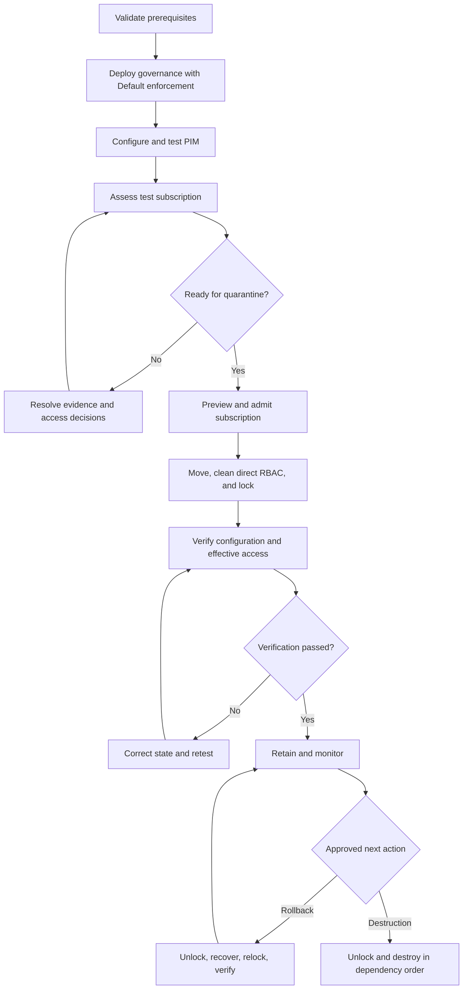

# Tenant Decommission Guardrails

This project creates, operates, and removes a reusable control-plane quarantine for Azure subscriptions retained during tenant decommissioning. It assumes the quarantine management group already exists.

## Problem

Tenant decommissioning rarely removes every subscription and resource at once. Some subscriptions remain temporarily for audit, rollback, data retention, dependency resolution, or staged destruction. During that period, existing access and automation can change, restart, expand, or delete retained workloads before the approved process is complete.

This solution places retained subscriptions under a consistent, reversible quarantine while preserving visibility and an approved recovery path.

## What The Solution Applies

| Control | Outcome |
|---|---|
| Management-group Policy | Blocks new indexed resource types and protects selected critical types from deletion. |
| Permanent Reader access | Preserves audit and operational visibility. |
| PIM-eligible recovery access | Provides approval-gated User Access Administrator and Contributor roles. |
| Direct RBAC review | Identifies and optionally removes unapproved direct write access. |
| Subscription `ReadOnly` lock | Supplies the broad control-plane freeze. |

No single control is a complete freeze. Read [Architecture And Safety](docs/architecture-and-safety.md) before production use.

## Runbooks

Follow these pages in order. Each contains prerequisites, commands, expected results, and stop conditions.

| Step | Runbook | Purpose |
|---|---|---|
| 0 | [Prerequisites And Setup](docs/00-prerequisites.md) | Validate tools, sign in, select the existing management group, and run local checks. |
| 1 | [Deploy Governance](docs/01-deploy-governance.md) | Deploy Policy, Reader assignments, and PIM eligibility in observation mode. |
| 2 | [Configure PIM](docs/02-configure-pim.md) | Configure and test activation policies for both eligible roles. |
| 3 | [Assess A Subscription](docs/03-assess-subscription.md) | Generate compact readiness evidence and approve RBAC decisions. |
| 4 | [Admit A Subscription](docs/04-admit-subscription.md) | Move the subscription, remove approved RBAC assignments, and apply the lock. |
| 5 | [Verify Enforcement](docs/05-verify-enforcement.md) | Verify placement, Policy, lock, RBAC, and effective behavior. |
| Operations | [Recovery And Destruction](docs/06-recovery-and-destruction.md) | Temporarily unlock for approved rollback or final destruction. |
| Teardown | [Remove The Solution](docs/07-remove-solution.md) | Remove subscription stacks and shared governance in the correct order. |

## Solution Flow

The governance foundation is deployed once. The subscription lifecycle is repeated for every retained subscription.



## Critical Safety Rules

- Policy defaults to `Default`; complete a full lifecycle rehearsal with a disposable subscription before admitting production subscriptions.
- Deployment stacks use `ActionOnUnmanage DeleteAll`. Removing a managed resource or stack can delete the underlying control.
- Never approve automatic RBAC removal from `ConservativeFallback` readiness classification.
- A `ReadOnly` lock blocks many action operations, including VM start and restart.
- The solution controls Azure Resource Manager operations, not data-plane credentials or application traffic.
- The scripts do not create or delete the quarantine management group and do not cancel subscriptions.

## Project Layout

```text
scenarios/subscription-quarantine/
  README.md                             Scenario overview
  docs/                                 Operator runbooks and architecture reference
infra/subscription-quarantine/
  governance.bicep                     Management-group Policy, RBAC, and PIM eligibility
  governance.example.bicepparam        Example governance parameters
  subscription-lock.bicep              Subscription ReadOnly lock
  subscription-lock.example.bicepparam
scripts/
  Deploy-QuarantineGovernance.ps1      Create or update governance stack
  Remove-QuarantineGovernance.ps1      Remove governance stack
  Get-QuarantineReadiness.ps1          Export compact pre-change evidence
  Enter-SubscriptionQuarantine.ps1     Move, optionally clean RBAC, and lock
  Test-SubscriptionQuarantine.ps1      Verify inherited controls
  Exit-SubscriptionQuarantine.ps1      Guarded unlock for rollback or destruction
  Quarantine.Common.psm1               Shared functions
tests/
  Smoke.Tests.ps1                      Offline syntax and helper checks
TASKS.md                               Follow-up work
```

## Validation

```powershell
az bicep build --file ./infra/subscription-quarantine/governance.bicep
az bicep build --file ./infra/subscription-quarantine/subscription-lock.bicep
az bicep build-params --file ./infra/subscription-quarantine/governance.example.bicepparam
az bicep build-params --file ./infra/subscription-quarantine/subscription-lock.example.bicepparam
./tests/Smoke.Tests.ps1
```

Always rehearse admission, timed rollback, relock, and destruction in a disposable subscription containing representative resources and child-scope RBAC before production rollout.
